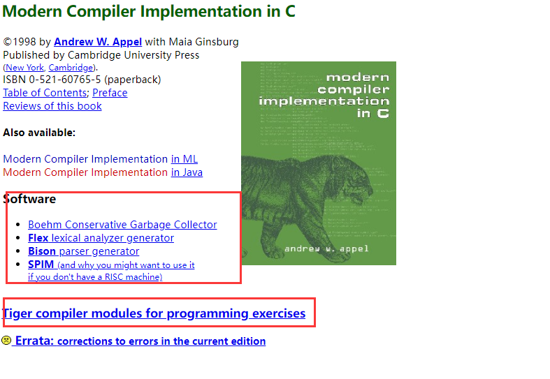
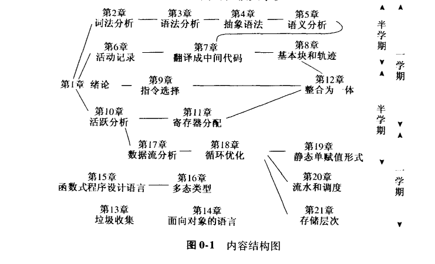

# MWSY-LearnCompilationPrinciple

## 前言

### 习题

每一章都有一个与编译器的一个模块对应的程序设计习题。在http://www.cs.princeton.edu/~appel/modern/c中可以找到相应帮助。打开此网址可以看到如下页面：

Software下载后放入项目的software文件夹内，Programming exercises放入到项目的exercises文件夹内

### 授课的顺序

* 一学期的课程可包含第一部分的所有章节，同时让学生实现编译器，多半按照项目组的方式进行。
* 高级课程或者研究生课程可包含第二部分内容
* 按两个半学习安排教学的话，前半个学期包含1-8章，后半个学期包括9-12章和第二部分的某些章